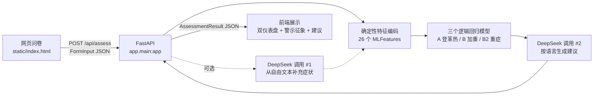

# jiayi — 登革热风险自评 Web 服务

基于 FastAPI 的登革热风险自评服务：用户在网页回答症状与病史问题，后端用**真实的登革热逻辑回归模型**（巴西 SINAN 2023–2025 年 944.99 万条通报数据训练）给出三项相对风险评分，再调用 DeepSeek 按用户选择的语言生成防蚊/就医/监测建议。

> ⚠️ **评分是相对风险参考值，不是感染概率**，且尚未在本地人群校准。详见「模型说明」。

## 架构流程



若无法渲染 mermaid，等价的 ASCII 流程：

```
网页问卷 → FastAPI → 确定性特征编码(26维) → 三模型打分 → DeepSeek 生成建议 → 前端展示
                ↑ 有备注时先用 DeepSeek 从自由文本补充症状（失败不影响主流程）
```

- 入口：`app.main:app`，生产端口 `80`（本地开发用 `8000`）
- 静态前端由 FastAPI 直接托管（`GET /` 返回 `static/index.html`）
- 健康检查：`GET /api/health` → `{"status":"ok","mock_mode":bool,"models":["A","B","B2"]}`
- 校验失败返回 422（FastAPI 默认）；服务器/上游错误返回 500/502，body 形如 `{"detail": "中文错误说明"}`

## 模型说明

模型系数存放在 `app/model/dengue_models.json`（2.9 KB），**只有系数，没有训练数据**——944 万条 SINAN 原始数据不参与部署。

| 模型 | 预测目标 | 样本量 | AUC |
|---|---|---|---|
| A | 是否登革热（确诊 vs 不确定） | 300,000 | 0.686 |
| B | 是否加重（警示+重症 vs 普通） | 364,246 | 0.722 |
| B2 | 是否重症（重症 vs 其他登革热） | 212,310 | **0.810** |

### 26 个特征

- **14 个症状**（二值）：FEBRE 发热、MIALGIA 肌痛、CEFALEIA 头痛、EXANTEMA 皮疹、VOMITO 呕吐、NAUSEA 恶心、DOR_COSTAS 背痛、CONJUNTVIT 结膜炎、ARTRITE 关节炎、ARTRALGIA 关节痛、PETEQUIA_N 瘀点、LEUCOPENIA 白细胞减少、LACO 束臂试验、DOR_RETRO 眼后痛
- **7 个合并症**（二值）：DIABETES、HEMATOLOG、HEPATOPAT、RENAL、HIPERTENSA、ACIDO_PEPT、AUTO_IMUNE
- **age**（原始岁数 0–110）、**sex_f**（女=1）、**day_ill**（病程 0–14 天）、**wk_sin / wk_cos**（流行病学周的周期编码，服务器按当日计算）

特征顺序见 `app/schemas.py` 的 `FEATS`，与训练脚本 `02_fit_models.py` 完全一致。

### 三态答案编码

问卷每项提供 **有 / 无 / 不知道** 三个选项，编码为 `yes→1`、`no→0`、`unknown→0`。

这不是偷懒：训练数据 SINAN 用 `1=有 2=无 9=未知`，特征工程里 `(df[c] == "1")` 意味着「无」和「未知」同为 0。所以「不知道」映射成 0 是**忠实于训练数据**的。这一点很重要——白细胞减少和束臂试验普通用户不可能知道。

### 0–100 分怎么来的

原始模型只导出了 `coef_`，**没有截距**，加上训练用了下采样 + `class_weight="balanced"`，所以：

- ❌ 不能用 `sigmoid(z)`：z 恒偏正，几乎所有有症状的人都会逼近 100 分
- ❌ 不能用理论区间归一化：`z_min` 对应「拥有全部负系数症状」这种反常状态，无症状的人反而落在中部（实测健康年轻人被判成 medium）
- ✅ 采用**参考人锚定**：

```
score = 100 × (z − z_ref) / (z_ceil − z_ref)     裁剪到 [0, 100]

z_ref  = 同季节、无任何症状与合并症、30 岁男性、病程 0 天
z_ceil = 同季节、所有升高风险的特征取到上界
```

分数含义是「相对于此刻一个无症状的人，你在这个模型上处在多高的位置」。季节项在三处相同因而自然抵消——这是刻意的，`wk_sin/wk_cos` 描述人群层面的季节基线而非个体差异（季节项仍参与 z 的计算并写入评测回流）。

实测分档效果：

| 用例 | 登革热 | 加重 | 重症 |
|---|---|---|---|
| 健康年轻人（25M，无症状） | 0 low | 0 low | 0 low |
| 轻症（30F，发热头痛 2 天） | 30.4 low | 0 low | 0 low |
| 典型登革热（35F，4 症状 3 天） | 45.1 medium | 1.1 low | 0 low |
| 重症高危（72M，白细胞减少+多种合并症） | 53.1 medium | 69.3 high | 70.1 high |

`low/medium/high` 阈值（35 / 65）是工程默认值，**部署到真实人群前需用保持原始患病率的测试集重新校准**（原项目 README「已知局限」）。`app/eval_log.py` 的回流数据就是为这一步准备的。

### WHO 警示征象（独立于模型）

模型 B/B2 由白细胞减少（系数 1.4–1.6）主导，未验血的患者即便已出现警示征象也可能得低分。因此后端额外做**规则判断**：用户报告 `VOMITO`（持续呕吐）或 `PETEQUIA_N`（皮肤黏膜出血）时，响应中返回 `warning_signs`，前端显示醒目提示并要求 DeepSeek 在建议中明确写出尽快就医。

### 已知迁移局限

- 模型训练于**南半球（巴西）**数据，季节项对北半球方向相反（本服务已让季节项在评分中抵消，影响有限）
- 原项目自述：缺乏真阴性对照、指标基于平衡测试集偏乐观、缺血小板/红细胞压积等强实验室指标

## 本地运行

要求 Python 3.10+。

```bash
# 1. 创建虚拟环境
python3 -m venv .venv
source .venv/bin/activate        # Windows: .venv\Scripts\activate

# 2. 安装依赖
pip install -r requirements.txt

# 3. 准备环境变量(默认 MOCK_MODE=true, 无需任何密钥即可跑通全流程)
cp .env.example .env

# 4. 启动
uvicorn app.main:app --reload --port 8000
```

打开浏览器访问 <http://localhost:8000> 即可看到问卷页面。`MOCK_MODE=true` 时不调用 DeepSeek：特征转换改用本地规则编码（与 DeepSeek 契约相同，见 `app/ml_model.py` 的 `encode_features`），评分由内置启发式模型给出，因此**演示评分会真实响应答卷内容**；建议文案返回按语言本地化的假数据。全程离线、无需任何密钥。

## 跑测试

```bash
pytest
```

## 多语言支持

`POST /api/assess` 的请求体支持可选字段 `language`（BCP 47 语言代码），控制后端返回内容（`summary`、`advice` 各条、`disclaimer`）的语言：

| 代码 | 语言 |
| --- | --- |
| `zh-CN` | 简体中文（默认） |
| `zh-TW` | 繁體中文 |
| `en` | English |
| `es` | Español |
| `pt` | Português |

要点：

- 不传 `language` 时默认 `zh-CN`；传入五种代码之外的值返回 422。
- `disclaimer` 为该语言的固定标准文案（见 `app/schemas.py` 中的 `DISCLAIMERS`）。
- `MOCK_MODE=true` 时，mock 的 `summary` 与 `advice` 也按 `language` 返回对应语言的本地化假数据。
- `MOCK_MODE=false`（真实模式）时，DeepSeek 第二次调用（建议生成）的 system prompt 会要求全部输出使用该语言；第一次调用（特征提取）不受影响，`MLFeatures` 是纯数字。
- 前端 UI 静态文案（标题、按钮、题目、选项等）的本地化由前端负责；建议内容与免责声明直接展示后端返回值。

## 接入真实 DeepSeek

编辑 `.env`：

```ini
DEEPSEEK_API_KEY=sk-你的密钥
DEEPSEEK_BASE_URL=https://api.deepseek.com
DEEPSEEK_MODEL=deepseek-chat     # 若使用 deepseek v4, 改成其 API 对应的实际模型名
MOCK_MODE=false
```

要点：

1. `DEEPSEEK_API_KEY` 必填，否则非 mock 模式下调用会失败（返回 502）。
2. `DEEPSEEK_MODEL` 填 API 文档里的模型标识符。例如你实际要用 deepseek v4，就把它改成 DeepSeek 平台上 v4 对应的模型名，而不是字面的 "v4"。
3. `MOCK_MODE=false` 后，DeepSeek#1（特征化）与 DeepSeek#2（建议生成）都会走真实 API。
4. 改完 `.env` 后重启服务生效（本地重跑 uvicorn；服务器上 `sudo systemctl restart jiayi`）。

## 更新模型系数

模型已内置，无需额外配置。要换成重新训练的版本，只需替换系数文件：

1. 训练侧导出 `coef_`（格式同 `02_fit_models.py` 写出的 `full_results.json`）
2. 覆盖 `app/model/dengue_models.json`
3. 重启服务

文件结构（三个模型各一段）：

```json
{
  "A":  { "name": "...", "auc": 0.6862, "coef": { "FEBRE_x": 0.904, "...": 0.0 } },
  "B":  { "...": "..." },
  "B2": { "...": "..." }
}
```

`app/ml_model.py` 按**特征名**查表点乘（不是按位置），所以系数顺序无所谓，但**键名必须与 `app/schemas.py` 的 `FEATS` 一致**。缺失的键按 0 处理并打 warning。

如果训练侧将来导出了 `intercept_`，可以改用真实概率取代当前的参考人锚定评分——那时请同步修改 `app/schemas.py` 的 `MODEL_NOTES` 文案，以及前端展示口径。

> 相关测试：`tests/test_pipeline.py::test_z_matches_hand_computed_value` 会手算一个已知输入的 z 值并与代码比对，能挡住系数读取或点乘错位的问题。

## 评测数据回流

为给模型做本地校准积累依据，每次 `/api/assess` 完成后，后端会把一条**脱敏**记录追加写入本地 JSONL 文件（默认 `data/assessments.jsonl`，每行一条 JSON）：

```json
{"timestamp": "2026-08-16T02:10:10+00:00", "language": "zh-CN", "mock_mode": true,
 "epi_week": 33,
 "features": {"FEBRE_x": 1, "LEUCOPENIA_x": 0, "age": 34.0, "...": 0},
 "scores": {
   "dengue":    {"score": 45.1, "level": "medium", "z": 2.219},
   "worsening": {"score": 1.1,  "level": "low",    "z": 0.21},
   "severe":    {"score": 0.0,  "level": "low",    "z": 0.125}
 },
 "has_notes": true}
```

要点：

- **notes 原文绝不落盘**，只记录 `has_notes` 布尔值；记录内容仅有 26 个数值特征、三个模型的评分与语言。
- 路径由 `.env` 中 `EVAL_LOG_PATH` 控制（相对路径相对项目根目录解析），**置空则关闭回流**；写入失败只记日志，不影响评估请求。
- `mock_mode` 字段标记该条是否为演示数据，离线分析时可过滤。

统计已积累的数据（三个模型各自的评分分布、等级占比、语言与周次分布）：

```bash
# Windows: .venv\Scripts\python.exe scripts\eval_stats.py
python scripts/eval_stats.py                    # 默认读 data/assessments.jsonl
python scripts/eval_stats.py 某个.jsonl --json   # 指定文件 / 输出机器可读 JSON
```

## 部署（AWS Lightsail / 任意 Ubuntu 云主机，不用 Docker / K8S）

**当前线上环境**：AWS Lightsail，Oregon (us-west-2)，2 vCPU / 2 GB / Ubuntu 24.04，服务以 `ubuntu` 用户跑在 80 端口。

在本机打包上传（不含密钥、训练数据与虚拟环境）：

```bash
tar czf /tmp/jiayi.tar.gz --exclude=.venv --exclude=__pycache__ --exclude='*.pyc' \
  --exclude=.pytest_cache --exclude=.git --exclude=data --exclude='*.pdf' \
  --exclude='*.zip' --exclude='.env' --exclude='*.pem' --exclude=account.txt .
scp -i ~/.ssh/你的密钥.pem /tmp/jiayi.tar.gz ubuntu@<公网IP>:/tmp/
```

在服务器上：

```bash
# 1. 依赖（Ubuntu 24.04 自带 Python 3.12，只需补 venv/pip）
sudo apt update
sudo apt install -y python3-venv python3-pip

# 2. 解包到 /opt/jiayi
sudo mkdir -p /opt/jiayi && sudo chown -R $USER:$USER /opt/jiayi
tar xzf /tmp/jiayi.tar.gz -C /opt/jiayi && cd /opt/jiayi

# 3. 虚拟环境与依赖
python3 -m venv .venv
./.venv/bin/pip install -r requirements.txt

# 4. 配置环境变量（含密钥，权限收紧）
cp .env.example .env && chmod 600 .env
vim .env        # 先用 MOCK_MODE=true 验证部署；拿到 key 后再切 false
mkdir -p data

# 5. 安装 systemd 服务（deploy/jiayi.service 已配好 ubuntu 用户 + 80 端口）
sudo cp deploy/jiayi.service /etc/systemd/system/
sudo systemctl daemon-reload
sudo systemctl enable --now jiayi

# 6. 验证
systemctl is-active jiayi
curl http://127.0.0.1/api/health
journalctl -u jiayi -f      # 实时日志
```

**最后一步（必须在云控制台做）**：放行 80 端口。

- **Lightsail**：实例 → Networking → IPv4 Firewall → Add rule → 选 `HTTP (80)`
- **阿里云 ECS**：安全组 → 入方向规则 → 放行 80

然后浏览器访问 `http://<公网IP>`。

> 服务以非 root 的 `ubuntu` 用户绑定 80 端口，靠 systemd 的 `AmbientCapabilities=CAP_NET_BIND_SERVICE` 实现，不需要 root 也不需要 nginx。
> 若改用 8000 等非特权端口，删掉 unit 里的 `AmbientCapabilities` / `CapabilityBoundingSet` 两行并改 `--port` 即可。

### 更新已部署的版本

```bash
# 本机重新打包上传后，在服务器上：
cd /opt/jiayi && tar xzf /tmp/jiayi.tar.gz
./.venv/bin/pip install -r requirements.txt   # 依赖有变动时
sudo systemctl restart jiayi
```

## 可选：nginx 反向代理 + HTTPS

直接暴露 8000 端口即可用；如需域名、80/443 端口和 HTTPS，可加一层 nginx：

```bash
sudo apt install -y nginx
sudo vim /etc/nginx/sites-available/jiayi
```

server 块示例：

```nginx
server {
    listen 80;
    server_name example.com;          # 换成你的域名

    location / {
        proxy_pass http://127.0.0.1:8000;
        proxy_set_header Host $host;
        proxy_set_header X-Real-IP $remote_addr;
        proxy_set_header X-Forwarded-For $proxy_add_x_forwarded_for;
        proxy_set_header X-Forwarded-Proto $scheme;
    }
}
```

启用并申请免费 HTTPS 证书（Let's Encrypt）：

```bash
sudo ln -s /etc/nginx/sites-available/jiayi /etc/nginx/sites-enabled/
sudo nginx -t && sudo systemctl reload nginx

sudo apt install -y certbot python3-certbot-nginx
sudo certbot --nginx -d example.com     # 自动改写 nginx 配置并配置续期
```

配好反代后，安全组只需放行 80/443，可以不再对公网暴露 8000。

## 免责声明

本项目提供的感染风险评分与建议由算法自动生成，**仅供参考，不构成医疗诊断或治疗建议**。评估结果不能替代专业医疗人员的判断；如出现不适或症状加重，请及时前往正规医疗机构就诊。使用本服务即表示知悉并同意上述条款。

## 目录结构

```
jiayi/
├── app/                     # 后端代码
│   ├── main.py              # FastAPI 入口 (app.main:app), 路由与静态托管
│   ├── ml_model.py          # ML 模型加载与 predict 接口 (含内置启发式假模型)
│   ├── eval_log.py          # 评测数据回流 (脱敏记录追加写 JSONL)
│   └── ...                  # DeepSeek 客户端 / Pydantic 模型 / 配置等
├── data/                    # 评测回流数据 (assessments.jsonl, 运行时生成)
├── scripts/
│   └── eval_stats.py        # 回流数据统计 (评分分布 / 各等级占比)
├── static/                  # 前端静态页面 (index.html 等)
├── tests/                   # pytest 测试
├── deploy/
│   ├── run.sh               # 启动脚本 (激活 .venv 并 exec uvicorn)
│   └── jiayi.service        # systemd 单元文件
├── .env.example             # 环境变量模板 (复制为 .env 使用)
├── requirements.txt         # Python 依赖
└── README.md
```
