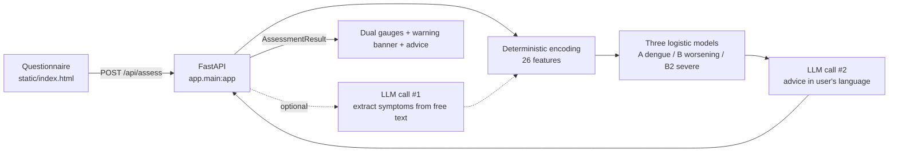

# Dengue Risk Self-Assessment — Web Service

FastAPI service that puts the dengue models from [`../model/`](../model/) in front of the public:
a six-step questionnaire, three relative-risk scores, and LLM-generated guidance in five languages.

**Live:** http://35.88.114.45

> ⚠️ Scores are **relative risk indicators, not infection probabilities**, and thresholds have not
> been calibrated for any local population. See [Scoring](#scoring) below.

---

## Architecture



Feature encoding is **deterministic and authoritative**. The first LLM call has one narrow job:
read the free-text notes field and flag symptoms the user described but did not tick. It may only
promote `unknown → yes`; it can never override an explicit answer, and any failure is logged and
ignored rather than failing the request.

- Entry point: `app.main:app` — port `80` in production, `8000` for local development
- Static frontend served directly by FastAPI (`GET /` returns `static/index.html`)
- Health: `GET /api/health` → `{"status":"ok","mock_mode":bool,"models":["A","B","B2"]}`
- Validation errors return 422; upstream/server errors return 502/500 with `{"detail": "..."}`

---

## The model

Coefficients live in [`app/model/dengue_models.json`](app/model/dengue_models.json) (2.9 KB) — a
copy of the research output in [`../model/results/`](../model/results/). No training data is
required at inference time. A test asserts the two copies never drift apart.

| Model | Field in response | Target | AUC |
|---|---|---|---|
| A | `dengue` | Dengue vs. inconclusive | 0.686 |
| B | `worsening` | Warning signs + severe vs. ordinary | 0.722 |
| B2 | `severe` | Severe vs. other dengue | **0.810** |

### Features (26)

Order is defined by `FEATS` in [`app/schemas.py`](app/schemas.py) and matches the training script
exactly.

- **14 symptoms** (binary): `FEBRE`, `MIALGIA`, `CEFALEIA`, `EXANTEMA`, `VOMITO`, `NAUSEA`,
  `DOR_COSTAS`, `CONJUNTVIT`, `ARTRITE`, `ARTRALGIA`, `PETEQUIA_N`, `LEUCOPENIA`, `LACO`,
  `DOR_RETRO`
- **7 comorbidities** (binary): `DIABETES`, `HEMATOLOG`, `HEPATOPAT`, `RENAL`, `HIPERTENSA`,
  `ACIDO_PEPT`, `AUTO_IMUNE`
- `age` (0–110), `sex_f` (female = 1), `day_ill` (0–14), `wk_sin` / `wk_cos` (seasonal harmonics,
  computed server-side from the current ISO week)

### Tri-state answers

Every symptom and comorbidity is answered **yes / no / don't know**, encoded `yes → 1`,
`no → 0`, `unknown → 0`.

This is not a shortcut. SINAN codes `1 = yes`, `2 = no`, `9 = unknown`, and the training pipeline's
`(df[c] == "1")` collapses "no" and "unknown" to the same value. Reproducing that convention keeps
inference faithful to training — and it matters in practice, because leukopenia and the tourniquet
test are among the strongest predictors and no member of the public knows their own values.

### Scoring

The training pipeline exported `coef_` but **not `intercept_`**, and used downsampling with
`class_weight="balanced"`. Two obvious approaches fail:

- `sigmoid(z)` — with no intercept, z is persistently positive and nearly every symptomatic user
  saturates near 100.
- Normalising against the theoretical range — `z_min` corresponds to holding *every*
  negative-coefficient symptom, an unreachable state; a genuinely asymptomatic person then lands
  mid-range (measured: a healthy 25-year-old scored "medium").

The service instead anchors on a **reference person**:

```
score = 100 × (z − z_ref) / (z_ceil − z_ref)          clipped to [0, 100]

z_ref  = same epidemiological week, no symptoms, no comorbidities, 30-year-old male, day 0
z_ceil = same week, every risk-increasing feature at its bound
```

The score therefore answers: *relative to a symptom-free person right now, where does this
respondent sit on this model?* The seasonal term appears identically in all three quantities and
cancels — deliberately, since `wk_sin`/`wk_cos` capture a population-level seasonal baseline
rather than individual risk. It still contributes to `z`, which is returned and logged.

Observed spread:

| Case | dengue | worsening | severe |
|---|---|---|---|
| Healthy 25M, no symptoms | 0 low | 0 low | 0 low |
| Mild: 30F, fever + headache, 2 days | 30.4 low | 0 low | 0 low |
| Typical: 35F, 4 symptoms, 3 days | 45.1 medium | 1.1 low | 0 low |
| High risk: 72M, leukopenia + 4 comorbidities | 53.1 medium | 69.3 **high** | 70.1 **high** |

The low/medium/high cut-offs (35 / 65) are engineering defaults. Recalibration on a
prevalence-preserving sample is required before clinical use; the eval log exists to support that.

### WHO warning signs — independent of the model

Models B and B2 are dominated by leukopenia (coefficients 1.4 and 1.6). A patient reporting
persistent vomiting and petechiae who has not had blood drawn can score "low" on all three models
— a false reassurance precisely where WHO advises seeking care.

The backend therefore applies a rule check on `VOMITO` and `PETEQUIA_N` and returns
`warning_signs`. The frontend shows a prominent alert, and the advice prompt is instructed to
recommend prompt medical assessment regardless of score.

---

## API

### `POST /api/assess`

```json
{
  "age": 34,
  "sex": "F",
  "day_ill": 3,
  "symptoms":      { "FEBRE": "yes", "CEFALEIA": "yes", "LEUCOPENIA": "unknown" },
  "comorbidities": { "DIABETES": "no" },
  "language": "zh-CN",
  "notes": ""
}
```

Omitted symptom/comorbidity keys default to `"unknown"`; unrecognised keys return 422.

```json
{
  "dengue":    { "score": 42.2, "level": "medium", "z": 1.9308 },
  "worsening": { "score": 20.3, "level": "low",    "z": 1.9528 },
  "severe":    { "score": 20.0, "level": "low",    "z": 3.2024 },
  "epi_week": 33,
  "warning_signs": ["VOMITO", "PETEQUIA_N"],
  "summary": "...",
  "advice": { "protection": ["..."], "medical": ["..."], "monitoring": ["..."] },
  "disclaimer": "...",
  "model_note": "Scores are relative risk indicators, not infection probabilities. ..."
}
```

### Languages

`language` accepts `zh-CN` (default), `zh-TW`, `en`, `es`, `pt`, and controls `summary`, `advice`,
`disclaimer`, and `model_note`. Static UI strings are localised in the frontend
([`static/app.js`](static/app.js)); the language selector persists to `localStorage` and falls back
to `navigator.language`.

---

## Running locally

Requires Python 3.10+.

```bash
python3 -m venv .venv
./.venv/bin/pip install -r requirements.txt

cp .env.example .env        # defaults to MOCK_MODE=true
./.venv/bin/uvicorn app.main:app --reload --port 8000
```

Open <http://localhost:8000>.

**In mock mode the risk scores are real** — computed by the actual model from your answers. Only
the natural-language advice is canned (localised per language). No API key required.

```bash
pytest tests          # 44 tests
```

---

## Using a real LLM

```ini
DEEPSEEK_API_KEY=sk-...
DEEPSEEK_BASE_URL=https://api.deepseek.com
DEEPSEEK_MODEL=deepseek-chat
MOCK_MODE=false
```

The client speaks the OpenAI-compatible `/chat/completions` format, so any compatible provider
works by changing `DEEPSEEK_BASE_URL` and `DEEPSEEK_MODEL`. JSON parse failures are fed back to the
model for up to two retries. Restart the service after editing `.env`
(`sudo systemctl restart jiayi`).

---

## Updating model coefficients

1. Re-run the training pipeline in [`../model/`](../model/)
2. Copy the output over both `../model/results/模型结果_三模型指标与系数.json` and
   `app/model/dengue_models.json`
3. Restart

Coefficients are looked up **by feature name**, not position, so ordering within the file does not
matter — but key names must match `FEATS` in `app/schemas.py`. Missing keys are treated as 0 with a
warning.

Two tests guard this path: `test_z_matches_hand_computed_value` recomputes a known z by hand, and
`test_bundled_coefficients_match_research_output` fails if the two copies drift apart.

If a future training run exports `intercept_`, the reference-anchored score can be replaced with a
calibrated probability — update `MODEL_NOTES` in `app/schemas.py` and the frontend wording at the
same time.

---

## Evaluation logging

Each assessment appends one **de-identified** JSON line to `data/assessments.jsonl`:

```json
{"timestamp": "2026-08-16T02:10:10+00:00", "language": "zh-CN", "mock_mode": true,
 "epi_week": 33,
 "features": {"FEBRE_x": 1, "LEUCOPENIA_x": 0, "age": 34.0},
 "scores": {"dengue": {"score": 45.1, "level": "medium", "z": 2.219}},
 "has_notes": true}
```

- **Free-text notes are never written to disk** — only a `has_notes` boolean. Records contain
  numeric features, scores, and language.
- Path is set by `EVAL_LOG_PATH` (relative paths resolve against the service root); **empty
  disables logging**. Write failures are logged and never affect the response.
- `mock_mode` marks demo traffic so it can be filtered during analysis.

```bash
python scripts/eval_stats.py            # per-model distributions, level shares, languages
python scripts/eval_stats.py --json     # machine-readable
```

This log is the raw material for the threshold recalibration described above.

---

## Deployment

Current production: AWS Lightsail, Oregon (us-west-2), 2 vCPU / 2 GB / Ubuntu 24.04, running as
`ubuntu` on port 80.

Package locally, excluding secrets and local state:

```bash
cd ..                       # repository root
tar czf /tmp/jiayi.tar.gz --exclude=.venv --exclude=__pycache__ --exclude='*.pyc' \
  --exclude=.pytest_cache --exclude=.git --exclude=data --exclude='.env' \
  --exclude='*.pem' --exclude=account.txt model service
scp -i ~/.ssh/your-key.pem /tmp/jiayi.tar.gz ubuntu@<PUBLIC_IP>:/tmp/
```

On the server:

```bash
sudo apt update && sudo apt install -y python3-venv python3-pip

sudo mkdir -p /opt/jiayi && sudo chown -R $USER:$USER /opt/jiayi
tar xzf /tmp/jiayi.tar.gz -C /opt/jiayi
cd /opt/jiayi/service

python3 -m venv .venv
./.venv/bin/pip install -r requirements.txt

cp .env.example .env && chmod 600 .env
vim .env                    # start with MOCK_MODE=true to validate the deployment
mkdir -p data

sudo cp deploy/jiayi.service /etc/systemd/system/
sudo systemctl daemon-reload
sudo systemctl enable --now jiayi

systemctl is-active jiayi
curl http://127.0.0.1/api/health
journalctl -u jiayi -f
```

Finally, open port 80 in the cloud firewall (Lightsail: *Networking → IPv4 Firewall → Add rule →
HTTP*), then browse to `http://<PUBLIC_IP>`.

The service binds port 80 as the unprivileged `ubuntu` user via systemd's
`AmbientCapabilities=CAP_NET_BIND_SERVICE` — no root, no nginx. To use an unprivileged port
instead, drop the two capability lines from the unit and change `--port`.

### Redeploying

```bash
cd /opt/jiayi && tar xzf /tmp/jiayi.tar.gz
cd service && ./.venv/bin/pip install -r requirements.txt   # if dependencies changed
sudo systemctl restart jiayi
```

### Optional: nginx + HTTPS

Only needed for a domain and TLS. Move uvicorn back to 8000 (edit `--port` and remove the
capability lines in `deploy/jiayi.service`), then let nginx own 80/443:

```nginx
server {
    listen 80;
    server_name example.com;
    location / {
        proxy_pass http://127.0.0.1:8000;
        proxy_set_header Host $host;
        proxy_set_header X-Real-IP $remote_addr;
        proxy_set_header X-Forwarded-For $proxy_add_x_forwarded_for;
        proxy_set_header X-Forwarded-Proto $scheme;
    }
}
```

```bash
sudo apt install -y certbot python3-certbot-nginx
sudo certbot --nginx -d example.com
```

---

## Layout

```
service/
├── app/
│   ├── main.py             FastAPI entry point, routes, static mounting
│   ├── schemas.py          FormInput / MLFeatures / AssessmentResult, FEATS, localised strings
│   ├── ml_model.py         coefficient loading, feature encoding, scoring
│   ├── pipeline.py         orchestration: encode → score → advise → assemble
│   ├── prompt_builder.py   the two LLM prompts
│   ├── deepseek_client.py  OpenAI-compatible client with JSON retry + mock data
│   ├── eval_log.py         de-identified evaluation logging
│   ├── config.py           .env settings
│   └── model/
│       └── dengue_models.json    fitted coefficients (mirror of ../model/results/)
├── static/                 hand-written frontend, zero external dependencies
├── tests/                  44 pytest tests
├── scripts/eval_stats.py   evaluation log statistics
├── deploy/                 systemd unit + manual launch script
├── .env.example
└── requirements.txt
```

---

## Disclaimer

Output is algorithmically generated and is **for reference only — not a medical diagnosis or
treatment recommendation**. It cannot replace assessment by a qualified clinician. Anyone who is
unwell, or whose symptoms worsen, should seek medical care promptly.
