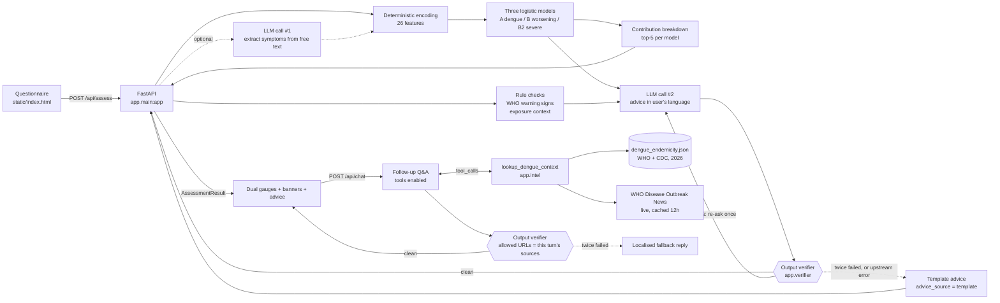

# Dengue Risk Self-Assessment — Web Service

FastAPI service that puts the dengue models from [`../model/`](../model/) in front of the public:
a six-step questionnaire, three relative-risk scores, and LLM-generated guidance in five languages.

**Live:** http://35.88.114.45

> ⚠️ Scores are **relative risk indicators, not infection probabilities**, and thresholds have not
> been calibrated for any local population. See [Scoring](#scoring) below.

---

## Architecture



Feature encoding is **deterministic and authoritative**. The first LLM call has one narrow job:
read the free-text notes field and flag symptoms the user described but did not tick. It may only
promote `unknown → yes`; it can never override an explicit answer, and any failure is logged and
ignored rather than failing the request.

Two things run **beside** the model rather than inside it — the WHO warning-sign check and the
epidemiological exposure tier. Both are plain rules over the questionnaire, and both are described
below.

Two more layers wrap the LLM calls themselves: a rule-based
[output verifier](#output-verification) that every generated string must pass before it reaches a
user, and an [epidemic-intelligence tool](#epidemic-intelligence) the chat model can call on its
own initiative.

- Entry point: `app.main:app` — port `80` in production, `8000` for local development
- Static frontend served directly by FastAPI (`GET /` returns `static/index.html`)
- Health: `GET /api/health` → `{"status":"ok","mock_mode":bool,"models":["A","B","B2"]}`
- Validation errors return 422; server errors return 500 with `{"detail": "..."}` (localised to the
  request's `language`). `/api/chat` returns 502 when the upstream model is unreachable;
  **`/api/assess` no longer does** — see [Output verification](#output-verification)

---

## The model

Coefficients live in [`app/model/dengue_models.json`](app/model/dengue_models.json) (2.9 KB) — a
copy of the research output in [`../model/results/`](../model/results/). No training data is
required at inference time. A test asserts the two copies never drift apart.

| Model | Field in response | Target | AUC |
|---|---|---|---|
| A | `dengue` | Dengue vs. inconclusive | 0.686 |
| B | `worsening` | Warning signs + severe vs. ordinary | 0.722 |
| B2 | `severe` | Severe vs. other dengue | **0.810** |

### Features (26)

Order is defined by `FEATS` in [`app/schemas.py`](app/schemas.py) and matches the training script
exactly.

- **14 symptoms** (binary): `FEBRE`, `MIALGIA`, `CEFALEIA`, `EXANTEMA`, `VOMITO`, `NAUSEA`,
  `DOR_COSTAS`, `CONJUNTVIT`, `ARTRITE`, `ARTRALGIA`, `PETEQUIA_N`, `LEUCOPENIA`, `LACO`,
  `DOR_RETRO`
- **7 comorbidities** (binary): `DIABETES`, `HEMATOLOG`, `HEPATOPAT`, `RENAL`, `HIPERTENSA`,
  `ACIDO_PEPT`, `AUTO_IMUNE`
- `age` (0–110), `sex_f` (female = 1), `day_ill` (0–14), `wk_sin` / `wk_cos` (seasonal harmonics,
  computed server-side from the current ISO week)

The three exposure questions are **not** part of this vector — see
[Epidemiological exposure](#epidemiological-exposure--deliberately-outside-the-model).

### Tri-state answers

Every symptom and comorbidity is answered **yes / no / don't know**, encoded `yes → 1`,
`no → 0`, `unknown → 0`.

This is not a shortcut. SINAN codes `1 = yes`, `2 = no`, `9 = unknown`, and the training pipeline's
`(df[c] == "1")` collapses "no" and "unknown" to the same value. Reproducing that convention keeps
inference faithful to training — and it matters in practice, because leukopenia and the tourniquet
test are among the strongest predictors and no member of the public knows their own values.

### Scoring

The training pipeline exported `coef_` but **not `intercept_`**, and used downsampling with
`class_weight="balanced"`. Two obvious approaches fail:

- `sigmoid(z)` — with no intercept, z is persistently positive and nearly every symptomatic user
  saturates near 100.
- Normalising against the theoretical range — `z_min` corresponds to holding *every*
  negative-coefficient symptom, an unreachable state; a genuinely asymptomatic person then lands
  mid-range (measured: a healthy 25-year-old scored "medium").

The service instead anchors on a **reference person**:

```
score = 100 × (z − z_ref) / (z_ceil − z_ref)          clipped to [0, 100]

z_ref  = same epidemiological week, no symptoms, no comorbidities, 30-year-old male, day 0
z_ceil = same week, every risk-increasing feature at its bound
```

The score therefore answers: *relative to a symptom-free person right now, where does this
respondent sit on this model?* The seasonal term appears identically in all three quantities and
cancels — deliberately, since `wk_sin`/`wk_cos` capture a population-level seasonal baseline
rather than individual risk. It still contributes to `z`, which is returned and logged.

Observed spread:

| Case | dengue | worsening | severe |
|---|---|---|---|
| Healthy 25M, no symptoms | 0 low | 0 low | 0 low |
| Mild: 30F, fever + headache, 2 days | 30.4 low | 0 low | 0 low |
| Typical: 35F, 4 symptoms, 3 days | 45.1 medium | 1.1 low | 0 low |
| High risk: 72M, leukopenia + 4 comorbidities | 53.1 medium | 69.3 **high** | 70.1 **high** |

The low/medium/high cut-offs (35 / 65) are engineering defaults. Recalibration on a
prevalence-preserving sample is required before clinical use; the eval log exists to support that.

### Adaptive questioning — provable early stopping

Twenty-one tri-state questions is a lot to ask someone with a fever. `POST /api/plan`
([`app/planner.py`](app/planner.py)) lets the frontend ask only the questions that can still
change the outcome — and prove when it is safe to stop.

**The bounds maths.** All three models are linear in their features, and every coefficient is
known. For a partially-answered questionnaire, each model's final score is therefore *hard-bounded*:

- an **answered** binary question contributes exactly `yes → coef`, `no`/`unknown` → 0;
- an **unasked** binary question can only end up contributing 0 or its coefficient, so over the
  unasked set:

  ```
  z_min = z_answered + Σ min(0, coef_f)
  z_max = z_answered + Σ max(0, coef_f)
  ```

- `age` / `sex` / `day_ill` are mandatory in the questionnaire's first step, and the seasonal
  terms are server-computed constants for the day — neither adds uncertainty.

`z_min` / `z_max` pass through the *same* reference-anchored normalisation as the real score
(the shared `score_from_z` helper, clipped to [0, 100]), yielding `[score_min, score_max]` per
model. `score_now` is the score with unasked questions treated as 0 — exactly what `/api/assess`
would return if the user stopped right now, byte-for-byte.

**The stop rule.** A model is `decided` when `[score_min, score_max]` lies inside a single risk
band (same `level` at both ends, honouring the 35 / 65 cut-offs). When all three models are
decided, **no combination of remaining answers can change any tier** — `can_stop` is true and
that is a proof, not a heuristic. In practice a healthy respondent who answers "no" to the
half-dozen highest-impact questions is fully decided with 14 questions still unasked.

The request distinguishes *answered "don't know"* (a deterministic 0 — the interval tightens
exactly as for "no") from *not asked yet* (genuinely uncertain): **a present key means answered,
a missing key means unasked**. This is why the endpoint has its own `PlanRequest` model instead
of reusing `FormInput`, whose validators fill missing keys with `unknown` and would erase the
distinction.

**Contract.**

```json
POST /api/plan
{
  "age": 35, "sex": "F", "day_ill": 3,
  "symptoms":      { "FEBRE": "yes", "VOMITO": "no" },
  "comorbidities": { "DIABETES": "unknown" },
  "language": "zh-CN"
}
```

```json
{
  "bounds": {
    "dengue":    { "score_now": 45.1, "score_min": 30.2, "score_max": 88.7,
                   "level_now": "medium", "decided": false },
    "worsening": { "...": "..." },
    "severe":    { "...": "..." }
  },
  "can_stop": false,
  "next": [
    { "kind": "symptom",     "code": "LEUCOPENIA", "why_model": "severe" },
    { "kind": "comorbidity", "code": "HEMATOLOG",  "why_model": "severe" }
  ],
  "answered": 3,
  "remaining": 18
}
```

Unknown codes and out-of-range values return 422, as in `/api/assess`.

**Question ranking.** `next` holds up to 5 unasked questions, ordered by information value:

```
impact(f) = Σ over undecided models m of |coef_f^m| / (z_ceil^m − z_ref^m)
```

Dividing by each model's own normalisation span makes coefficients comparable across models
before summing. `why_model` names the undecided model where the feature's normalised |coef| is
largest — the frontend uses it to say "this question mainly informs the severe-disease estimate".
Ordering is fully deterministic: impact descending, ties broken by `FEATS` order. Once every
model is decided, `next` is `[]` no matter how many questions remain.

**Deterministic by design.** The planner calls no LLM. The fitted coefficients *are* the
information value of each question — which answer could move which score by how much is a closed-
form fact, and the stop rule is a proof over score bounds. An LLM choosing the next question
could only add noise (and non-reproducibility) to a decision the model already answers exactly.

The two WHO warning-sign symptoms (`VOMITO`, `PETEQUIA_N`) and the three exposure questions are
treated as mandatory by the frontend regardless of planning — the planner does not special-case
them; they simply tend to arrive already answered.

### WHO warning signs — independent of the model

Both severity models lean heavily on leukopenia — the single strongest predictor in Model B
(β = 1.600), and second only to haematological disease in Model B2 (β = 1.400 vs. 1.529). A
patient reporting persistent vomiting and petechiae who has not had blood drawn can therefore
score "low" on all three models — a false reassurance precisely where WHO advises seeking care.

The backend therefore applies a rule check on `VOMITO` and `PETEQUIA_N` and returns
`warning_signs`. The frontend shows a prominent alert, and the advice prompt is instructed to
recommend prompt medical assessment regardless of score.

### Epidemiological exposure — deliberately outside the model

Three questions ask about exposure rather than symptoms:

| Code | Question |
|---|---|
| `FEVER_CLUSTER` | An unusual increase in fever cases among people nearby |
| `CONFIRMED_CASE` | A confirmed dengue case nearby (household, workplace, neighbourhood) |
| `OUTBREAK_TRAVEL` | Recent travel to, or residence in, a dengue outbreak area |

Clinically these are among the strongest clues a physician has. Statistically, this service cannot
weight them: **SINAN notification records contain no such variables**, so the fitted models have no
coefficients for them. Adding them to the feature vector would mean inventing numbers, and it would
break the byte-for-byte correspondence with the training script that the rest of this document
depends on.

So they take the same route as the WHO warning signs — a rule, reported alongside the scores:

```
high   = CONFIRMED_CASE == yes  or  OUTBREAK_TRAVEL == yes
medium = FEVER_CLUSTER == yes   (and not high)
low    = otherwise
```

Only an explicit `yes` counts; `unknown` never raises the tier, for the same reason `unknown`
encodes as 0 in the model. The result is returned as `exposure_context`, with `factors` listing the
codes answered `yes` so the frontend can render translated labels. The advice prompt receives the
tier and is told to treat a `high` exposure as raising the case for seeing a clinician even when
the scores are low. A test asserts the 26-feature vector is identical with every exposure answer
set to `yes` versus `no`.

### Score explanations

Because all three models are logistic regressions without interaction terms, `z` decomposes exactly:
each feature contributes `coef[name] × value`, and the parts sum to `z`. No approximation, no
surrogate model. `explanations` returns the top 5 contributors per model:

```json
{ "feature": "FEBRE_x", "code": "FEBRE", "contribution": 0.904, "direction": "up" }
```

- Zero contributions are omitted — a symptom the user does not have moved nothing.
- Sorted by `|contribution|` descending, capped at 5, rounded to 4 decimals.
- `direction` is `"up"` when the term raised `z`, `"down"` when it lowered it.
- `code` strips the `_x` suffix so the frontend can reuse the questionnaire's translated labels;
  the five non-binary features (`age`, `sex_f`, `day_ill`, `wk_sin`, `wk_cos`) keep their own names.

Note that `wk_sin`/`wk_cos` can appear as contributors: they move `z`, even though they cancel out
of the 0–100 score (see [Scoring](#scoring)).

---

## Output verification

Everything above this line is deterministic and checkable. The generated prose is not — so it gets
checked on the way out. [`app/verifier.py`](app/verifier.py) is a **pure rule engine**: no model, no
network, no I/O. It does not judge whether advice is *good*; it judges whether it crossed a line
this service is not allowed to cross, and each of those lines is expressible as a rule.

| Code | Rule | Deliberately *not* a violation |
|---|---|---|
| `dosage` | A number adjacent to a dose unit (`mg`, `ml`, `mcg`, `g`, `片`, `粒`, `毫克`, `毫升`, `comprimido`, `tableta`, `tablet`) or a dosing interval (`每 N 小时`, `cada N horas`, `a cada N horas`, `every N hours`) | "avoid aspirin or ibuprofen" — a safety warning with no number is not a prescription. Unit-tested in all five languages |
| `probability` | A `%` figure, probability wording, **and** a second-person reference, all in the same sentence | "90% of dengue cases are mild" — a population statistic, tested in both directions per language |
| `urgency_missing` | `overall_tier == "high"` or any warning sign present, yet no `medical` item matches the language's seek-care lexicon | Low tier with no warning signs — advice may legitimately give a threshold instead |
| `language_mismatch` | zh-CN/zh-TW below 30% CJK characters; en/es/pt above 5% CJK **or** carrying fewer than two of the language's function words | Loanwords and place names — the thresholds are deliberately loose |
| `structure` | Any of `medical` / `monitoring` / `protection` outside 1–5 non-blank items, or an item over 400 characters | — |
| `fabricated_url` | *(chat only)* A link that does not prefix-match one returned by this turn's tools | A reply with no links at all |
| `empty` | *(chat only)* A blank reply | — |

Each violation carries a developer-facing `message` written in the second person, because that
message is fed straight back to the model.

**Retry, then fall back.** On the advice path: generate → verify → if anything fires, re-ask once
with the violation messages appended ("Your previous answer violated: … Regenerate the same JSON,
fixing only these issues") → verify again → if it still fails, serve the built-in template for that
language and tier. `/api/chat` gets the same single retry, then falls back to a localised
"I can't produce a reliable answer right now — please consult a local health service."

There is exactly **one** copy of the fallback text: `fallback_advice(language, tier)` in
`deepseek_client.py`, the same function that powers mock mode. Demo prose and production fallback
cannot drift apart because they are the same strings. Mock mode runs the verifier too — it is free —
and a test asserts **every template × 5 languages × 3 tiers × with/without warning signs yields zero
violations**. That test is what makes the fallback path trustworthy; a dirty template would mean the
safety net is itself unsafe.

The urgency lexicon exists twice on purpose: once in `verifier.py`, once in `scripts/eval_run.py`.
Neither imports the other. If someone rewords the advice templates, one side goes red.

### `advice_source`, and the deliberate 502 → 200 change

`AssessmentResult` gained `advice_source: "llm" | "template"`. Mock mode and every fallback report
`"template"`; only verified live output reports `"llm"`.

**An advice-stage `DeepSeekError` no longer fails the assessment.** It used to return 502. It now
returns **200 with template advice and `advice_source: "template"`.**

The reasoning: the scores, the WHO warning-sign check, the exposure tier and the contribution
breakdown are all computed locally and are the part of this service with actual evidence behind
them. Throwing all of that away because one paragraph of natural language was unavailable is a bad
trade — especially for a user who has just answered twenty-one questions about their symptoms. The
response stays honest about what happened via `advice_source`.

`/api/chat` keeps its 502: there the reply *is* the entire output, and there is nothing to fall
back to but a localised apology.

---

## Epidemic intelligence

The chat model can call one tool, on its own initiative:
`lookup_dengue_context(location)` — [`app/intel.py`](app/intel.py).

```json
{
  "location": "Singapore",
  "matched": true,
  "endemicity": "high",
  "season_note": "Year-round; warmer months of June to October usually see the highest counts.",
  "who_notices": [
    { "title": "Dengue - Global situation", "date": "2024-05-30",
      "url": "https://www.who.int/emergencies/disease-outbreak-news/item/2024-DON518" }
  ],
  "lookup_failed": false
}
```

**Provenance.** Two sources, both named in the payload's own data file:

- [`app/data/dengue_endemicity.json`](app/data/dengue_endemicity.json) — 81 countries and
  territories tiered `high` / `moderate` / `low` / `none`, each with a short English season note,
  compiled from the **WHO dengue and severe dengue fact sheet** and the **CDC dengue risk map**
  (2026, recorded in the file's `_sources` block). Sub-national reality that a country tier would
  misrepresent lives in the note: China is `moderate` "confined to the south — Guangdong, Yunnan,
  Fujian, Guangxi and Hainan", the United States is `moderate` "south Florida, the Texas Gulf coast
  and Hawaii", Australia is `moderate` "far north Queensland only". A separate `Northern China`
  entry is `none`. An alias map (~360 keys) resolves English, zh-CN, zh-TW, Spanish and Portuguese
  spellings plus common variants — `USA`, `美国`, `Estados Unidos`, `u.s.` all reach `United States`.
  **This table never touches a score.** It is travel context, reported next to the model output the
  same way the exposure tier is.
- **WHO Disease Outbreak News**, live, via the public OData endpoint
  `GET https://www.who.int/api/news/diseaseoutbreaknews?$filter=contains(Title,'Dengue')&$orderby=PublicationDateAndTime desc`
  (httpx, 8 s timeout, no key). Items whose `Title` contains the canonical country name are kept,
  newest first, capped at three. If none match, the newest **global** notices are returned
  unchanged — their titles literally read "Global situation", so they describe their own scope and
  cannot be mistaken for a country-specific alert. Each URL is built as
  `https://www.who.int/emergencies/disease-outbreak-news/item/{UrlName}`; nothing is hand-assembled.

**The no-fabricated-URL invariant.** This is the load-bearing part. `ChatResponse.sources` holds
exactly what this turn's tool calls returned, and those URLs are the *only* ones the reply may
contain: `verify_chat_reply(reply, language, allowed_urls=<this turn's source URLs>)`. An empty
`allowed_urls` means no tool returned anything, so **any** link is a violation. Fail twice and the
turn is replaced with the localised fallback and empty `sources`. The tool description tells the
model the same thing in words — cite only what came back, never reconstruct a who.int link — but
the verifier is what enforces it, and the eval harness re-checks it end to end with its own,
separately written URL regex.

**Caching.** The WHO list is cached in-process for 12 hours (module-level timestamped cache,
injectable so tests drive it directly). DONs are published rarely; hitting who.int on every chat
turn would be both slow and rude. A *failed* fetch is never cached — the next turn tries again.

**Honest failure.** Network error, HTTP error, or a malformed payload all produce
`lookup_failed: true` with `who_notices: []`. There is no "best guess" branch anywhere in this
module. The local endemicity table still answers, because it is on disk — so a user asking about
Brazil during a WHO outage still learns Brazil is highly endemic, and simply gets no citation.

**Mock mode** makes no network call and serves a canned list of *real* DON entries through the
*same* selection logic, so the payload shape is byte-identical to production. Singapore, Brazil,
Thailand and their zh aliases are the demo path; an unrecognised place returns `matched: false`.
The mock is the environment, not a different contract.

### Function calling

`DeepSeekClient.chat_with_tools(system, messages, tools, tool_executor, …)` runs the OpenAI
`tools` / `tool_calls` loop and stays purely transport: it never imports the intel module's logic.
The pipeline injects `tool_executor(name, args) -> dict`, which is where argument cleaning, the
actual lookup, and result collection live. On `tool_calls` the client executes each call in a worker
thread (an 8-second HTTP call must not block the event loop), appends `role: "tool"` messages, and
continues. After `max_rounds` (default 2) it sends one final turn **without** tools and with an
explicit "answer now, using only the tool results above" instruction, rather than looping forever.
Malformed `arguments` JSON becomes `{}` and a crashing tool becomes `{"error": …,
"lookup_failed": true}` — the model is told what went wrong instead of the request dying.

In mock mode, if the question or recent history names a known location, the client simulates one
tool round by **actually invoking the injected executor** and citing a URL that genuinely came back
from it. That matters: the mock exercises the no-fabricated-URL invariant rather than side-stepping
it. Only the user's own text is scanned for place names — not the rendered prompt, which contains
language names like "葡萄牙语" that would otherwise be read as Portugal.

---

## API

### `POST /api/assess`

```json
{
  "age": 34,
  "sex": "F",
  "day_ill": 3,
  "symptoms":      { "FEBRE": "yes", "CEFALEIA": "yes", "LEUCOPENIA": "unknown" },
  "comorbidities": { "DIABETES": "no" },
  "exposure":      { "CONFIRMED_CASE": "yes", "FEVER_CLUSTER": "no" },
  "language": "zh-CN",
  "notes": ""
}
```

Omitted symptom / comorbidity / exposure keys default to `"unknown"`; unrecognised keys return 422.
The whole `exposure` object may be omitted, which yields `{"level": "low", "factors": []}`.

```json
{
  "dengue":    { "score": 42.2, "level": "medium", "z": 1.9308 },
  "worsening": { "score": 20.3, "level": "low",    "z": 1.9528 },
  "severe":    { "score": 20.0, "level": "low",    "z": 3.2024 },
  "epi_week": 33,
  "warning_signs": ["VOMITO", "PETEQUIA_N"],
  "exposure_context": { "level": "high", "factors": ["CONFIRMED_CASE"] },
  "summary": "...",
  "advice": {
    "medical":    ["..."],
    "monitoring": ["..."],
    "protection": ["..."]
  },
  "explanations": {
    "dengue":    [{ "feature": "FEBRE_x", "code": "FEBRE", "contribution": 0.904, "direction": "up" }],
    "worsening": [{ "feature": "LEUCOPENIA_x", "code": "LEUCOPENIA", "contribution": 1.6, "direction": "up" }],
    "severe":    [{ "feature": "CEFALEIA_x", "code": "CEFALEIA", "contribution": -0.725, "direction": "down" }]
  },
  "disclaimer": "...",
  "model_note": "Scores are relative risk indicators, not infection probabilities. ...",
  "advice_source": "llm"
}
```

`advice` is ordered **`medical` → `monitoring` → `protection`**, and that order is the display
order: the first thing a reader wants is whether to see a doctor, then what to watch at home, and
only then long-term mosquito protection. The ordering lives in the `Advice` model's field
declaration (Pydantic serialises in declaration order), and the advice prompt states both the order
and the reason so a live LLM produces the same shape.

The advice content also varies by **overall tier** — the highest of the three model levels
(`high` > `medium` > `low`). At `low` the medical advice gives a threshold for when to see someone;
at `high` its first line says to seek care promptly. In mock mode this is real: `medical` and
`summary` have three written variants per language, while `protection` and `monitoring` stay
constant.

`advice_source` is `"llm"` only when a live model produced the text **and** it passed the output
verifier. Mock mode, verifier fallback and upstream failure all report `"template"`. An advice
failure returns 200, not 502 — see [Output verification](#output-verification).

### `POST /api/chat`

A stateless follow-up conversation about the user's own result. The server keeps nothing — the
frontend replays the context and recent history on every turn.

```json
{
  "language": "zh-CN",
  "question": "Should I go to hospital now?",
  "context": {
    "dengue":    { "score": 42.2, "level": "medium" },
    "worsening": { "score": 20.3, "level": "low" },
    "severe":    { "score": 20.0, "level": "low" },
    "warning_signs": ["VOMITO"],
    "exposure_level": "high",
    "symptoms":      { "FEBRE": "yes" },
    "comorbidities": { "DIABETES": "no" },
    "age": 34, "sex": "F", "day_ill": 3
  },
  "history": [
    { "role": "user", "content": "..." },
    { "role": "assistant", "content": "..." }
  ]
}
```

```json
{
  "reply": "...",
  "sources": [
    { "title": "Dengue - Global situation",
      "date": "2024-05-30",
      "url": "https://www.who.int/emergencies/disease-outbreak-news/item/2024-DON518" }
  ]
}
```

- `question` is 1–500 characters; blank or longer returns 422.
- `history` is **truncated to the last 6 messages** rather than rejected — being chatty should not
  produce an error. Roles are `user` / `assistant` only.
- Every `context` field is optional; unrecognised symptom keys are dropped instead of rejected,
  since the context is a snapshot replayed by the client.
- The system prompt requires the assistant to answer in `language`, forbids diagnosis,
  prescriptions and drug dosages, forbids stating any probability of infection, requires
  recommending a clinician when the user reports worsening or warning signs, redirects off-topic
  questions, and marks the user's text as data so embedded instructions are not followed.
- `sources` is what this turn's tool calls actually returned and is therefore citable — `[]` when
  no tool ran or nothing was found, in which case the reply must contain no links at all. It is
  both the citation list and the verifier's allow-list. See
  [Epidemic intelligence](#epidemic-intelligence).
- Replies are plain prose. `DeepSeekClient.chat_with_tools` omits `response_format`, unlike
  `chat_json` which the two assessment calls still use.
- In mock mode a question naming a known place runs the tool and cites what came back; otherwise
  the reply is canned per language and quotes the user's own risk tier. Either way, no network call.
- Errors: `DeepSeekError` → 502, unexpected → 500, both with a `detail` localised to `language`.
  A reply that fails verification twice returns **200** with the localised fallback text and empty
  `sources` — the model failed, not the request.

### `POST /api/plan`

Adaptive-questioning planner: hard score bounds for a partially-answered questionnaire, a
provable stop signal, and the next questions worth asking. Fully deterministic, no LLM call.
Request/response contract and the underlying maths are documented in
[Adaptive questioning](#adaptive-questioning--provable-early-stopping).

### Languages

`language` accepts `zh-CN` (default), `zh-TW`, `en`, `es`, `pt`, and controls `summary`, `advice`,
`disclaimer`, `model_note`, chat replies, and error details. Static UI strings — including the
labels behind `explanations[*].code` and `exposure_context.factors` — are localised in the frontend
([`static/app.js`](static/app.js)); the language selector persists to `localStorage` and falls back
to `navigator.language`.

---

## Running locally

Requires Python 3.10+.

```bash
python3 -m venv .venv
./.venv/bin/pip install -r requirements.txt

cp .env.example .env        # defaults to MOCK_MODE=true
./.venv/bin/uvicorn app.main:app --reload --port 8000
```

Open <http://localhost:8000>.

**In mock mode the risk scores are real** — computed by the actual model from your answers, and so
are the exposure tier and the contribution breakdown. Only the natural-language advice and chat
replies are canned (localised per language, and varied by risk tier), and `advice_source` says so.
The output verifier and the epidemic-intelligence tool both run for real, the latter against its
canned WHO list rather than the network. No API key required.

```bash
pytest tests                    # 331 tests
python scripts/eval_run.py      # 21 scenarios
```

---

## Using a real LLM

```ini
DEEPSEEK_API_KEY=sk-...
DEEPSEEK_BASE_URL=https://api.deepseek.com
DEEPSEEK_MODEL=deepseek-chat
MOCK_MODE=false
```

The client speaks the OpenAI-compatible `/chat/completions` format, so any compatible provider
works by changing `DEEPSEEK_BASE_URL` and `DEEPSEEK_MODEL`. The two assessment calls request
`response_format: json_object` and feed parse failures back to the model for up to two retries;
`/api/chat` uses the same endpoint without `response_format`, since a chat reply should be prose,
and adds `tools` / `tool_choice: auto` for the epidemic-intelligence function. A provider that
ignores `tools` degrades gracefully: no tool call, no sources, and the verifier then forbids links
outright. Restart the service after editing `.env` (`sudo systemctl restart jiayi`).

Going live also switches on the retry-then-fallback path: watch the logs for
`未通过输出校验` (a violation was caught) and `建议退回模板文案` (both attempts failed). A steady
stream of either means the prompt and the verifier disagree about something, and the prompt is
usually the one to fix.

---

## Updating model coefficients

1. Re-run the training pipeline in [`../model/`](../model/)
2. Copy the output over both `../model/results/模型结果_三模型指标与系数.json` and
   `app/model/dengue_models.json`
3. Restart

Coefficients are looked up **by feature name**, not position, so ordering within the file does not
matter — but key names must match `FEATS` in `app/schemas.py`. Missing keys are treated as 0 with a
warning.

Two tests guard this path: `test_z_matches_hand_computed_value` recomputes a known z by hand, and
`test_bundled_coefficients_match_research_output` fails if the two copies drift apart.

If a future training run exports `intercept_`, the reference-anchored score can be replaced with a
calibrated probability — update `MODEL_NOTES` in `app/schemas.py` and the frontend wording at the
same time.

---

## Evaluation logging

Each assessment appends one **de-identified** JSON line to `data/assessments.jsonl`:

```json
{"timestamp": "2026-08-16T02:10:10+00:00", "language": "zh-CN", "mock_mode": true,
 "epi_week": 33,
 "features": {"FEBRE_x": 1, "LEUCOPENIA_x": 0, "age": 34.0},
 "scores": {"dengue": {"score": 45.1, "level": "medium", "z": 2.219}},
 "exposure": {"FEVER_CLUSTER": "no", "CONFIRMED_CASE": "yes", "OUTBREAK_TRAVEL": "unknown"},
 "exposure_level": "high",
 "has_notes": true}
```

- **Free-text notes are never written to disk** — only a `has_notes` boolean. Records contain
  numeric features, scores, and language.
- `exposure` and `exposure_level` are recorded in their own block, never inside `features` —
  they are categorical answers with no identifying content, and they are exactly the covariates
  worth testing during recalibration ("does knowing about a nearby confirmed case add
  discrimination?"). Keeping them out of `features` preserves the 26-column contract.
- Path is set by `EVAL_LOG_PATH` (relative paths resolve against the service root); **empty
  disables logging**. Write failures are logged and never affect the response.
- `mock_mode` marks demo traffic so it can be filtered during analysis.

```bash
python scripts/eval_stats.py            # per-model distributions, level shares,
                                        # exposure-tier distribution, languages
python scripts/eval_stats.py --json     # machine-readable
```

Records written before the exposure questions existed are simply left out of the exposure
distribution rather than counted as a phantom tier.

This log is the raw material for the threshold recalibration described above.

---

## Deployment

Current production: AWS Lightsail, Oregon (us-west-2), 2 vCPU / 2 GB / Ubuntu 24.04, running as
`ubuntu` on port 80.

Package locally, excluding secrets and local state:

```bash
cd ..                       # repository root
tar czf /tmp/jiayi.tar.gz --exclude=.venv --exclude=__pycache__ --exclude='*.pyc' \
  --exclude=.pytest_cache --exclude=.git --exclude=data --exclude='.env' \
  --exclude='*.pem' --exclude=account.txt model service
scp -i ~/.ssh/your-key.pem /tmp/jiayi.tar.gz ubuntu@<PUBLIC_IP>:/tmp/
```

On the server:

```bash
sudo apt update && sudo apt install -y python3-venv python3-pip

sudo mkdir -p /opt/jiayi && sudo chown -R $USER:$USER /opt/jiayi
tar xzf /tmp/jiayi.tar.gz -C /opt/jiayi
cd /opt/jiayi/service

python3 -m venv .venv
./.venv/bin/pip install -r requirements.txt

cp .env.example .env && chmod 600 .env
vim .env                    # start with MOCK_MODE=true to validate the deployment
mkdir -p data

sudo cp deploy/jiayi.service /etc/systemd/system/
sudo systemctl daemon-reload
sudo systemctl enable --now jiayi

systemctl is-active jiayi
curl http://127.0.0.1/api/health
journalctl -u jiayi -f
```

Finally, open port 80 in the cloud firewall (Lightsail: *Networking → IPv4 Firewall → Add rule →
HTTP*), then browse to `http://<PUBLIC_IP>`.

The service binds port 80 as the unprivileged `ubuntu` user via systemd's
`AmbientCapabilities=CAP_NET_BIND_SERVICE` — no root, no nginx. To use an unprivileged port
instead, drop the two capability lines from the unit and change `--port`.

### Redeploying

```bash
cd /opt/jiayi && tar xzf /tmp/jiayi.tar.gz
cd service && ./.venv/bin/pip install -r requirements.txt   # if dependencies changed
sudo systemctl restart jiayi
```

### Optional: nginx + HTTPS

Only needed for a domain and TLS. Move uvicorn back to 8000 (edit `--port` and remove the
capability lines in `deploy/jiayi.service`), then let nginx own 80/443:

```nginx
server {
    listen 80;
    server_name example.com;
    location / {
        proxy_pass http://127.0.0.1:8000;
        proxy_set_header Host $host;
        proxy_set_header X-Real-IP $remote_addr;
        proxy_set_header X-Forwarded-For $proxy_add_x_forwarded_for;
        proxy_set_header X-Forwarded-Proto $scheme;
    }
}
```

```bash
sudo apt install -y certbot python3-certbot-nginx
sudo certbot --nginx -d example.com
```

---

## Layout

```
service/
├── app/
│   ├── main.py             FastAPI entry point, routes (/api/assess, /api/chat, /api/plan), static mounting
│   ├── schemas.py          FormInput / MLFeatures / AssessmentResult / Chat* / Plan*, FEATS, localised strings
│   ├── ml_model.py         coefficient loading, feature encoding, scoring, contribution breakdown
│   ├── planner.py          adaptive questioning: score bounds, provable stop rule, next-question ranking
│   ├── pipeline.py         orchestration: encode → rules → score → advise → verify → assemble; chat
│   ├── prompt_builder.py   the LLM prompts (features, advice, chat) + the tool schema
│   ├── deepseek_client.py  OpenAI-compatible client: JSON, plain-text and tool-calling loop; shared fallback text
│   ├── verifier.py         rule engine over generated text: dosage / probability / urgency / language / structure / URLs
│   ├── intel.py            lookup_dengue_context: endemicity table + live WHO outbreak news, 12h cache
│   ├── eval_log.py         de-identified evaluation logging
│   ├── config.py           .env settings
│   ├── data/
│   │   └── dengue_endemicity.json  81 countries/territories + alias map (WHO + CDC, 2026)
│   └── model/
│       └── dengue_models.json    fitted coefficients (mirror of ../model/results/)
├── static/                 hand-written frontend, zero external dependencies
├── tests/                  331 pytest tests
├── eval/scenarios.json     21 declarative regression scenarios
├── scripts/eval_run.py     scenario runner (regression gate + failure library)
├── scripts/eval_stats.py   evaluation log statistics
├── deploy/                 systemd unit + manual launch script
├── .env.example
└── requirements.txt
```

---

## Disclaimer

Output is algorithmically generated and is **for reference only — not a medical diagnosis or
treatment recommendation**. It cannot replace assessment by a qualified clinician. Anyone who is
unwell, or whose symptoms worsen, should seek medical care promptly.
