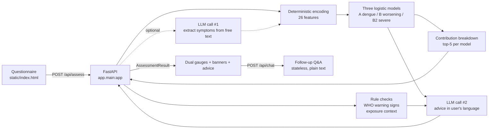

# Dengue Risk Self-Assessment — Web Service

FastAPI service that puts the dengue models from [`../model/`](../model/) in front of the public:
a six-step questionnaire, three relative-risk scores, and LLM-generated guidance in five languages.

**Live:** http://35.88.114.45

> ⚠️ Scores are **relative risk indicators, not infection probabilities**, and thresholds have not
> been calibrated for any local population. See [Scoring](#scoring) below.

---

## Architecture



Feature encoding is **deterministic and authoritative**. The first LLM call has one narrow job:
read the free-text notes field and flag symptoms the user described but did not tick. It may only
promote `unknown → yes`; it can never override an explicit answer, and any failure is logged and
ignored rather than failing the request.

Two things run **beside** the model rather than inside it — the WHO warning-sign check and the
epidemiological exposure tier. Both are plain rules over the questionnaire, and both are described
below.

- Entry point: `app.main:app` — port `80` in production, `8000` for local development
- Static frontend served directly by FastAPI (`GET /` returns `static/index.html`)
- Health: `GET /api/health` → `{"status":"ok","mock_mode":bool,"models":["A","B","B2"]}`
- Validation errors return 422; upstream/server errors return 502/500 with `{"detail": "..."}`
  (localised to the request's `language`)

---

## The model

Coefficients live in [`app/model/dengue_models.json`](app/model/dengue_models.json) (2.9 KB) — a
copy of the research output in [`../model/results/`](../model/results/). No training data is
required at inference time. A test asserts the two copies never drift apart.

| Model | Field in response | Target | AUC |
|---|---|---|---|
| A | `dengue` | Dengue vs. inconclusive | 0.686 |
| B | `worsening` | Warning signs + severe vs. ordinary | 0.722 |
| B2 | `severe` | Severe vs. other dengue | **0.810** |

### Features (26)

Order is defined by `FEATS` in [`app/schemas.py`](app/schemas.py) and matches the training script
exactly.

- **14 symptoms** (binary): `FEBRE`, `MIALGIA`, `CEFALEIA`, `EXANTEMA`, `VOMITO`, `NAUSEA`,
  `DOR_COSTAS`, `CONJUNTVIT`, `ARTRITE`, `ARTRALGIA`, `PETEQUIA_N`, `LEUCOPENIA`, `LACO`,
  `DOR_RETRO`
- **7 comorbidities** (binary): `DIABETES`, `HEMATOLOG`, `HEPATOPAT`, `RENAL`, `HIPERTENSA`,
  `ACIDO_PEPT`, `AUTO_IMUNE`
- `age` (0–110), `sex_f` (female = 1), `day_ill` (0–14), `wk_sin` / `wk_cos` (seasonal harmonics,
  computed server-side from the current ISO week)

The three exposure questions are **not** part of this vector — see
[Epidemiological exposure](#epidemiological-exposure--deliberately-outside-the-model).

### Tri-state answers

Every symptom and comorbidity is answered **yes / no / don't know**, encoded `yes → 1`,
`no → 0`, `unknown → 0`.

This is not a shortcut. SINAN codes `1 = yes`, `2 = no`, `9 = unknown`, and the training pipeline's
`(df[c] == "1")` collapses "no" and "unknown" to the same value. Reproducing that convention keeps
inference faithful to training — and it matters in practice, because leukopenia and the tourniquet
test are among the strongest predictors and no member of the public knows their own values.

### Scoring

The training pipeline exported `coef_` but **not `intercept_`**, and used downsampling with
`class_weight="balanced"`. Two obvious approaches fail:

- `sigmoid(z)` — with no intercept, z is persistently positive and nearly every symptomatic user
  saturates near 100.
- Normalising against the theoretical range — `z_min` corresponds to holding *every*
  negative-coefficient symptom, an unreachable state; a genuinely asymptomatic person then lands
  mid-range (measured: a healthy 25-year-old scored "medium").

The service instead anchors on a **reference person**:

```
score = 100 × (z − z_ref) / (z_ceil − z_ref)          clipped to [0, 100]

z_ref  = same epidemiological week, no symptoms, no comorbidities, 30-year-old male, day 0
z_ceil = same week, every risk-increasing feature at its bound
```

The score therefore answers: *relative to a symptom-free person right now, where does this
respondent sit on this model?* The seasonal term appears identically in all three quantities and
cancels — deliberately, since `wk_sin`/`wk_cos` capture a population-level seasonal baseline
rather than individual risk. It still contributes to `z`, which is returned and logged.

Observed spread:

| Case | dengue | worsening | severe |
|---|---|---|---|
| Healthy 25M, no symptoms | 0 low | 0 low | 0 low |
| Mild: 30F, fever + headache, 2 days | 30.4 low | 0 low | 0 low |
| Typical: 35F, 4 symptoms, 3 days | 45.1 medium | 1.1 low | 0 low |
| High risk: 72M, leukopenia + 4 comorbidities | 53.1 medium | 69.3 **high** | 70.1 **high** |

The low/medium/high cut-offs (35 / 65) are engineering defaults. Recalibration on a
prevalence-preserving sample is required before clinical use; the eval log exists to support that.

### WHO warning signs — independent of the model

Both severity models lean heavily on leukopenia — the single strongest predictor in Model B
(β = 1.600), and second only to haematological disease in Model B2 (β = 1.400 vs. 1.529). A
patient reporting persistent vomiting and petechiae who has not had blood drawn can therefore
score "low" on all three models — a false reassurance precisely where WHO advises seeking care.

The backend therefore applies a rule check on `VOMITO` and `PETEQUIA_N` and returns
`warning_signs`. The frontend shows a prominent alert, and the advice prompt is instructed to
recommend prompt medical assessment regardless of score.

### Epidemiological exposure — deliberately outside the model

Three questions ask about exposure rather than symptoms:

| Code | Question |
|---|---|
| `FEVER_CLUSTER` | An unusual increase in fever cases among people nearby |
| `CONFIRMED_CASE` | A confirmed dengue case nearby (household, workplace, neighbourhood) |
| `OUTBREAK_TRAVEL` | Recent travel to, or residence in, a dengue outbreak area |

Clinically these are among the strongest clues a physician has. Statistically, this service cannot
weight them: **SINAN notification records contain no such variables**, so the fitted models have no
coefficients for them. Adding them to the feature vector would mean inventing numbers, and it would
break the byte-for-byte correspondence with the training script that the rest of this document
depends on.

So they take the same route as the WHO warning signs — a rule, reported alongside the scores:

```
high   = CONFIRMED_CASE == yes  or  OUTBREAK_TRAVEL == yes
medium = FEVER_CLUSTER == yes   (and not high)
low    = otherwise
```

Only an explicit `yes` counts; `unknown` never raises the tier, for the same reason `unknown`
encodes as 0 in the model. The result is returned as `exposure_context`, with `factors` listing the
codes answered `yes` so the frontend can render translated labels. The advice prompt receives the
tier and is told to treat a `high` exposure as raising the case for seeing a clinician even when
the scores are low. A test asserts the 26-feature vector is identical with every exposure answer
set to `yes` versus `no`.

### Score explanations

Because all three models are logistic regressions without interaction terms, `z` decomposes exactly:
each feature contributes `coef[name] × value`, and the parts sum to `z`. No approximation, no
surrogate model. `explanations` returns the top 5 contributors per model:

```json
{ "feature": "FEBRE_x", "code": "FEBRE", "contribution": 0.904, "direction": "up" }
```

- Zero contributions are omitted — a symptom the user does not have moved nothing.
- Sorted by `|contribution|` descending, capped at 5, rounded to 4 decimals.
- `direction` is `"up"` when the term raised `z`, `"down"` when it lowered it.
- `code` strips the `_x` suffix so the frontend can reuse the questionnaire's translated labels;
  the five non-binary features (`age`, `sex_f`, `day_ill`, `wk_sin`, `wk_cos`) keep their own names.

Note that `wk_sin`/`wk_cos` can appear as contributors: they move `z`, even though they cancel out
of the 0–100 score (see [Scoring](#scoring)).

---

## API

### `POST /api/assess`

```json
{
  "age": 34,
  "sex": "F",
  "day_ill": 3,
  "symptoms":      { "FEBRE": "yes", "CEFALEIA": "yes", "LEUCOPENIA": "unknown" },
  "comorbidities": { "DIABETES": "no" },
  "exposure":      { "CONFIRMED_CASE": "yes", "FEVER_CLUSTER": "no" },
  "language": "zh-CN",
  "notes": ""
}
```

Omitted symptom / comorbidity / exposure keys default to `"unknown"`; unrecognised keys return 422.
The whole `exposure` object may be omitted, which yields `{"level": "low", "factors": []}`.

```json
{
  "dengue":    { "score": 42.2, "level": "medium", "z": 1.9308 },
  "worsening": { "score": 20.3, "level": "low",    "z": 1.9528 },
  "severe":    { "score": 20.0, "level": "low",    "z": 3.2024 },
  "epi_week": 33,
  "warning_signs": ["VOMITO", "PETEQUIA_N"],
  "exposure_context": { "level": "high", "factors": ["CONFIRMED_CASE"] },
  "summary": "...",
  "advice": {
    "medical":    ["..."],
    "monitoring": ["..."],
    "protection": ["..."]
  },
  "explanations": {
    "dengue":    [{ "feature": "FEBRE_x", "code": "FEBRE", "contribution": 0.904, "direction": "up" }],
    "worsening": [{ "feature": "LEUCOPENIA_x", "code": "LEUCOPENIA", "contribution": 1.6, "direction": "up" }],
    "severe":    [{ "feature": "CEFALEIA_x", "code": "CEFALEIA", "contribution": -0.725, "direction": "down" }]
  },
  "disclaimer": "...",
  "model_note": "Scores are relative risk indicators, not infection probabilities. ..."
}
```

`advice` is ordered **`medical` → `monitoring` → `protection`**, and that order is the display
order: the first thing a reader wants is whether to see a doctor, then what to watch at home, and
only then long-term mosquito protection. The ordering lives in the `Advice` model's field
declaration (Pydantic serialises in declaration order), and the advice prompt states both the order
and the reason so a live LLM produces the same shape.

The advice content also varies by **overall tier** — the highest of the three model levels
(`high` > `medium` > `low`). At `low` the medical advice gives a threshold for when to see someone;
at `high` its first line says to seek care promptly. In mock mode this is real: `medical` and
`summary` have three written variants per language, while `protection` and `monitoring` stay
constant.

### `POST /api/chat`

A stateless follow-up conversation about the user's own result. The server keeps nothing — the
frontend replays the context and recent history on every turn.

```json
{
  "language": "zh-CN",
  "question": "Should I go to hospital now?",
  "context": {
    "dengue":    { "score": 42.2, "level": "medium" },
    "worsening": { "score": 20.3, "level": "low" },
    "severe":    { "score": 20.0, "level": "low" },
    "warning_signs": ["VOMITO"],
    "exposure_level": "high",
    "symptoms":      { "FEBRE": "yes" },
    "comorbidities": { "DIABETES": "no" },
    "age": 34, "sex": "F", "day_ill": 3
  },
  "history": [
    { "role": "user", "content": "..." },
    { "role": "assistant", "content": "..." }
  ]
}
```

```json
{ "reply": "..." }
```

- `question` is 1–500 characters; blank or longer returns 422.
- `history` is **truncated to the last 6 messages** rather than rejected — being chatty should not
  produce an error. Roles are `user` / `assistant` only.
- Every `context` field is optional; unrecognised symptom keys are dropped instead of rejected,
  since the context is a snapshot replayed by the client.
- The system prompt requires the assistant to answer in `language`, forbids diagnosis,
  prescriptions and drug dosages, forbids stating any probability of infection, requires
  recommending a clinician when the user reports worsening or warning signs, redirects off-topic
  questions, and marks the user's text as data so embedded instructions are not followed.
- Replies are plain prose. `DeepSeekClient.chat_text` omits `response_format`, unlike `chat_json`
  which the two assessment calls still use.
- In mock mode the reply is canned per language and quotes the user's own risk tier — no network
  call.
- Errors: `DeepSeekError` → 502, unexpected → 500, both with a `detail` localised to `language`.

### Languages

`language` accepts `zh-CN` (default), `zh-TW`, `en`, `es`, `pt`, and controls `summary`, `advice`,
`disclaimer`, `model_note`, chat replies, and error details. Static UI strings — including the
labels behind `explanations[*].code` and `exposure_context.factors` — are localised in the frontend
([`static/app.js`](static/app.js)); the language selector persists to `localStorage` and falls back
to `navigator.language`.

---

## Running locally

Requires Python 3.10+.

```bash
python3 -m venv .venv
./.venv/bin/pip install -r requirements.txt

cp .env.example .env        # defaults to MOCK_MODE=true
./.venv/bin/uvicorn app.main:app --reload --port 8000
```

Open <http://localhost:8000>.

**In mock mode the risk scores are real** — computed by the actual model from your answers, and so
are the exposure tier and the contribution breakdown. Only the natural-language advice and chat
replies are canned (localised per language, and varied by risk tier). No API key required.

```bash
pytest tests          # 92 tests
```

---

## Using a real LLM

```ini
DEEPSEEK_API_KEY=sk-...
DEEPSEEK_BASE_URL=https://api.deepseek.com
DEEPSEEK_MODEL=deepseek-chat
MOCK_MODE=false
```

The client speaks the OpenAI-compatible `/chat/completions` format, so any compatible provider
works by changing `DEEPSEEK_BASE_URL` and `DEEPSEEK_MODEL`. The two assessment calls request
`response_format: json_object` and feed parse failures back to the model for up to two retries;
`/api/chat` uses the same endpoint without `response_format`, since a chat reply should be prose.
Restart the service after editing `.env` (`sudo systemctl restart jiayi`).

---

## Updating model coefficients

1. Re-run the training pipeline in [`../model/`](../model/)
2. Copy the output over both `../model/results/模型结果_三模型指标与系数.json` and
   `app/model/dengue_models.json`
3. Restart

Coefficients are looked up **by feature name**, not position, so ordering within the file does not
matter — but key names must match `FEATS` in `app/schemas.py`. Missing keys are treated as 0 with a
warning.

Two tests guard this path: `test_z_matches_hand_computed_value` recomputes a known z by hand, and
`test_bundled_coefficients_match_research_output` fails if the two copies drift apart.

If a future training run exports `intercept_`, the reference-anchored score can be replaced with a
calibrated probability — update `MODEL_NOTES` in `app/schemas.py` and the frontend wording at the
same time.

---

## Evaluation logging

Each assessment appends one **de-identified** JSON line to `data/assessments.jsonl`:

```json
{"timestamp": "2026-08-16T02:10:10+00:00", "language": "zh-CN", "mock_mode": true,
 "epi_week": 33,
 "features": {"FEBRE_x": 1, "LEUCOPENIA_x": 0, "age": 34.0},
 "scores": {"dengue": {"score": 45.1, "level": "medium", "z": 2.219}},
 "exposure": {"FEVER_CLUSTER": "no", "CONFIRMED_CASE": "yes", "OUTBREAK_TRAVEL": "unknown"},
 "exposure_level": "high",
 "has_notes": true}
```

- **Free-text notes are never written to disk** — only a `has_notes` boolean. Records contain
  numeric features, scores, and language.
- `exposure` and `exposure_level` are recorded in their own block, never inside `features` —
  they are categorical answers with no identifying content, and they are exactly the covariates
  worth testing during recalibration ("does knowing about a nearby confirmed case add
  discrimination?"). Keeping them out of `features` preserves the 26-column contract.
- Path is set by `EVAL_LOG_PATH` (relative paths resolve against the service root); **empty
  disables logging**. Write failures are logged and never affect the response.
- `mock_mode` marks demo traffic so it can be filtered during analysis.

```bash
python scripts/eval_stats.py            # per-model distributions, level shares,
                                        # exposure-tier distribution, languages
python scripts/eval_stats.py --json     # machine-readable
```

Records written before the exposure questions existed are simply left out of the exposure
distribution rather than counted as a phantom tier.

This log is the raw material for the threshold recalibration described above.

---

## Deployment

Current production: AWS Lightsail, Oregon (us-west-2), 2 vCPU / 2 GB / Ubuntu 24.04, running as
`ubuntu` on port 80.

Package locally, excluding secrets and local state:

```bash
cd ..                       # repository root
tar czf /tmp/jiayi.tar.gz --exclude=.venv --exclude=__pycache__ --exclude='*.pyc' \
  --exclude=.pytest_cache --exclude=.git --exclude=data --exclude='.env' \
  --exclude='*.pem' --exclude=account.txt model service
scp -i ~/.ssh/your-key.pem /tmp/jiayi.tar.gz ubuntu@<PUBLIC_IP>:/tmp/
```

On the server:

```bash
sudo apt update && sudo apt install -y python3-venv python3-pip

sudo mkdir -p /opt/jiayi && sudo chown -R $USER:$USER /opt/jiayi
tar xzf /tmp/jiayi.tar.gz -C /opt/jiayi
cd /opt/jiayi/service

python3 -m venv .venv
./.venv/bin/pip install -r requirements.txt

cp .env.example .env && chmod 600 .env
vim .env                    # start with MOCK_MODE=true to validate the deployment
mkdir -p data

sudo cp deploy/jiayi.service /etc/systemd/system/
sudo systemctl daemon-reload
sudo systemctl enable --now jiayi

systemctl is-active jiayi
curl http://127.0.0.1/api/health
journalctl -u jiayi -f
```

Finally, open port 80 in the cloud firewall (Lightsail: *Networking → IPv4 Firewall → Add rule →
HTTP*), then browse to `http://<PUBLIC_IP>`.

The service binds port 80 as the unprivileged `ubuntu` user via systemd's
`AmbientCapabilities=CAP_NET_BIND_SERVICE` — no root, no nginx. To use an unprivileged port
instead, drop the two capability lines from the unit and change `--port`.

### Redeploying

```bash
cd /opt/jiayi && tar xzf /tmp/jiayi.tar.gz
cd service && ./.venv/bin/pip install -r requirements.txt   # if dependencies changed
sudo systemctl restart jiayi
```

### Optional: nginx + HTTPS

Only needed for a domain and TLS. Move uvicorn back to 8000 (edit `--port` and remove the
capability lines in `deploy/jiayi.service`), then let nginx own 80/443:

```nginx
server {
    listen 80;
    server_name example.com;
    location / {
        proxy_pass http://127.0.0.1:8000;
        proxy_set_header Host $host;
        proxy_set_header X-Real-IP $remote_addr;
        proxy_set_header X-Forwarded-For $proxy_add_x_forwarded_for;
        proxy_set_header X-Forwarded-Proto $scheme;
    }
}
```

```bash
sudo apt install -y certbot python3-certbot-nginx
sudo certbot --nginx -d example.com
```

---

## Layout

```
service/
├── app/
│   ├── main.py             FastAPI entry point, routes (/api/assess, /api/chat), static mounting
│   ├── schemas.py          FormInput / MLFeatures / AssessmentResult / Chat*, FEATS, localised strings
│   ├── ml_model.py         coefficient loading, feature encoding, scoring, contribution breakdown
│   ├── pipeline.py         orchestration: encode → rules → score → advise → assemble; chat
│   ├── prompt_builder.py   the LLM prompts (features, advice, chat)
│   ├── deepseek_client.py  OpenAI-compatible client, JSON + plain-text calls, tiered mock data
│   ├── eval_log.py         de-identified evaluation logging
│   ├── config.py           .env settings
│   └── model/
│       └── dengue_models.json    fitted coefficients (mirror of ../model/results/)
├── static/                 hand-written frontend, zero external dependencies
├── tests/                  92 pytest tests
├── scripts/eval_stats.py   evaluation log statistics
├── deploy/                 systemd unit + manual launch script
├── .env.example
└── requirements.txt
```

---

## Disclaimer

Output is algorithmically generated and is **for reference only — not a medical diagnosis or
treatment recommendation**. It cannot replace assessment by a qualified clinician. Anyone who is
unwell, or whose symptoms worsen, should seek medical care promptly.
